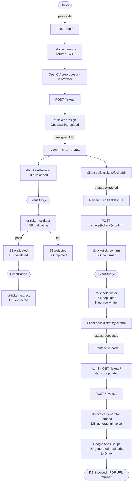
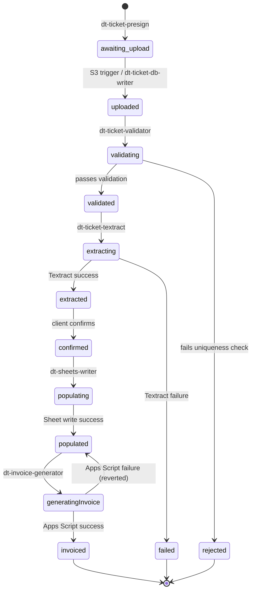

# Dump Truck Backend

A ticket processing app for a small trucking/construction business. Drivers photograph paper tickets in the field; the app validates, extracts, and populates a Google Sheet, then generates invoices as PDFs.

---

## Pipeline Overview

---

## Ticket Status Machine

---

## Auth

- Each driver has their own passcode; admin has a separate one
- Client submits passcode via POST to `/login` on API Gateway
- `dt-login` Lambda validates the passcode and returns a signed JWT (crypto library)
- All downstream routes have a custom Lambda authorizer (`dt-jwt-authorizer`) that validates the token

---

## Frontend Processing

Before upload, the client preprocesses the ticket image using OpenCV:

- Reject unsupported formats
- Convert to grayscale
- Reduce noise with Gaussian blur
- Edge detection (Canny)
- Morphological transform
- Contour detection and sorting
- Ticket area / image area ratio validation
- Find largest polygon and simplify to 4-point polygon
- Validate ticket width/height ratio
- Perspective transform
- Rotate if landscape

Client displays the processed image for preview before uploading.

---

## Raw Upload

1. Client sends POST to `/tickets`
2. `dt-jwt-authorizer` authorizes the request
3. `dt-ticket-presign` Lambda:
   - Grabs user identity from token
   - Generates a random `ticketId`
   - Creates a record in `ticket-db` with status `awaiting-upload`
   - Returns a presigned S3 PUT URL
4. Client PUTs image directly to S3 `/raw` using the presigned URL
5. Client begins polling `/tickets/{ticketId}` (see [Client Polling](#client-polling))

---

## Cloud Validation and Extraction

### S3 Trigger → dt-ticket-db-writer
- Triggered by new object in S3 `/raw`
- Fetches ticket record from DB
- Updates status to `uploaded` only if status === `awaiting-upload`
- On success: publishes event to EventBridge

### EventBridge → dt-ticket-validator
- Updates status to `validating` only if status === `uploaded`
- Sets `validationStartedAt` timestamp (used by `dt-ticket-stage-recovery`)
- Downloads ticket from S3 `/raw`
- Verifies `image/jpeg` content type
- Verifies file size (10 KB – 5 MB)
- TODO: verify aspect ratio
- TODO: verify blur index
- OCRs just the ticket number using Textract
- Checks ticket number uniqueness against `dt-ticket-number-db` DynamoDB table
  - If uniqueness check fails: updates status to `rejected` only if status === `validating`
- TODO: normalize image size
- Sends PUT to S3 `/validated` or `/rejected`
- Updates status to `validated` or `rejected` only if status === `validating`
- On success: publishes `TicketExtractionRequested` event to EventBridge

### EventBridge → dt-ticket-textract
- Updates status to `extracting` only if status === `validated`
- Sets `lastUpdated` timestamp (used by `dt-ticket-stage-recovery`)
- Loads ticket from S3 `/validated`
- Runs Textract
- Updates extracted data in `ticket-db`
- Updates status to `extracted` or `failed` only if status === `extracting`

---

## Client Polling

After the S3 PUT, the client polls `/tickets/{ticketId}`:

- `dt-jwt-authorizer` authorizes the token
- `dt-ticket-db-reader` Lambda:
  - Returns error if ticket doesn't exist
  - Returns error if `driverId` doesn't match requester
  - Returns current status (drives polling logic on client)
  - If status === `extracted`, also returns:
    - Extracted ticket data
    - Presigned GET URL for S3 `/validated`

---

## Client Ticket Review

1. Client receives extracted data + validated image URL
2. UI displays image with extracted fields, all editable
3. Driver reviews and edits fields
4. Client sends POST to `/tickets/{ticketId}/confirm`
5. `dt-jwt-authorizer` authorizes the token
6. `dt-ticket-db-confirm` Lambda:
   - Validates the submitted `confirmedData`:
     - All required fields present: `ticketNumber`, `date`, `day`, `customerName`, `jobName`, `start`, `stop`, `truckNo`
     - `ticketNumber` matches `^\d{4,10}$`
     - String fields don't start with formula-injection characters (`=`, `+`, `-`, `@`)
     - `date` parses (accepts `YYYY-MM-DD` and `M/D/YY[YY]`) and is a real calendar date
     - Normalizes `date` to `M/D/YYYY` (no leading zeros)
     - `day` matches the weekday derived from `date`
     - `date` is within the past 7 days
     - `start`/`stop` match `HH:MM`
   - DynamoDB transaction (atomic):
     - Updates `ticket-db` status to `confirmed` only if status === `extracted`, sets `confirmedData` and `ticketDate`
     - Inserts the ticket number into `ticket-number-db` (condition: `attribute_not_exists`); transaction fails if the number was already filed
   - On success: publishes `TicketConfirmed` event to EventBridge
7. Client polls `/tickets/{ticketId}` until status === `populated`

---

## Google Sheets Population

### EventBridge → dt-sheets-writer

> **Note:** Google Sheets is the business's source of truth. Tickets can be processed manually directly in Sheets. A planned **dt-sheets-sync** lambda will run at the start of the pipeline to sync Sheets → Dynamo so the backend is aware of manually processed tickets.

- Updates status to `populating` only if status === `confirmed`
- Sets `populatingAt` timestamp (used by `dt-ticket-stage-recovery`)
- Computes `hours` (quarter-hour rounded) and `amount = hours * rate` from `start`/`stop`
- Rejects the ticket (status → `rejected`) if `amount > $5,000`
- Builds the new row in memory using this schema:

  | Col | Field         |
  |-----|---------------|
  | A   | Date          |
  | B   | Customer      |
  | C   | Job           |
  | D   | Ticket # (`HYPERLINK` to validated image) |
  | E   | Start Time    |
  | F   | End Time      |
  | G   | Hours         |
  | H   | Amount        |
  | I   | Invoice # (left blank; filled by Apps Script) |
  | J   | Paid (left blank) |
  | K   | Rate          |
  | L   | Truck #       |
  | M   | Notes (left blank) |
  | N   | Flags (left blank) |

- Appends the row via `sheets.spreadsheets.values.append` (Google atomically picks the next empty row, so no read-then-write race)
- Parses the assigned row number out of the response's `updates.updatedRange` and persists it as `sheetsRow` on the ticket
- Updates status to `populated` in `ticket-db` only if status === `populating`
- Flips `ticket-number-db` row to `populated` (best-effort; skipped if not in `confirmed`)
- Publishes `TicketPopulated` event

---

## Invoice Generation

### Admin View

- Admin sends GET to `/tickets?status=populated`
- `dt-ticket-db-reader` Lambda fetches all tickets with status `populated`
- Returns `confirmedData`, `confirmedAt`, `driverId`, `validatedKey`, and `status` per ticket
- UI shows badge if there are unprocessed tickets
- Admin groups tickets by earliest date, clicks "Generate Invoice"

### POST /invoices → dt-invoice-generator Lambda

- Fetches all tickets from `ticket-db` with status === `populated` and matching date (using `status-date-index`)
- Single DynamoDB transaction: updates all matched tickets to `generatingInvoice` only if status === `populated`, stamping `timestamps.generatingInvoiceTimestamp`
- If any ticket fails the transition, Lambda exits with error (recovery Lambda planned)
- Calls Google Apps Script endpoint

### Apps Script

- Verifies request claims say `ADMIN`
- Fetches `sheetsRow` for each ticket
- Reads those rows from the Google Sheet
- Compares each field from Dynamo against Sheets to confirm they match
- Finds the lowest row number among the tickets and calculates the new invoice number by incrementing the previous one
- Feeds rows, invoice number, total hours, and total amount into an HTML template
- Generates a PDF and uploads to Google Drive
- Writes the new invoice number into the Sheet for those rows and links the PDF URL
- Returns success to Lambda with the PDF URL and invoice number

### Invoice PDF Fetch

`InvoicePdfFetch` Lambda proxies a Google Drive PDF by `fileId` (query or path parameter), returning the raw bytes base64-encoded with `Content-Type: application/pdf` and a 5-minute private cache header. Used by the admin UI to display invoice PDFs without exposing Drive credentials to the client.

### dt-invoice-generator Lambda (continued)

- Receives PDF URL and invoice ID from Apps Script
- If Apps Script fails: reverts each ticket's status back to `populated` and records `lastInvoiceFailureReason` (condition: status === `generatingInvoice`)
- On success: transactionally updates each ticket to status === `invoiced`, sets `invoiceId` and `invoicePdfUrl` (condition: status === `generatingInvoice`). If this final update fails after Apps Script already produced the PDF, tickets stay in `generatingInvoice` and require manual reconciliation (logged for tracing)
- Returns success to client with the PDF URL

---

## Planned Handlers (stubs)

The following handler folders exist but are not yet implemented:

- **`TicketSheetsSync`** — will sync Sheets → Dynamo so tickets processed manually in the sheet are visible to the backend (referenced in [Google Sheets Population](#google-sheets-population)).
- **`TicketStageRecovery`** — will scan for tickets stuck in transient states (`validating`, `extracting`, `populating`, `generatingInvoice`) past their `*At` timestamp and either retry or mark them failed.