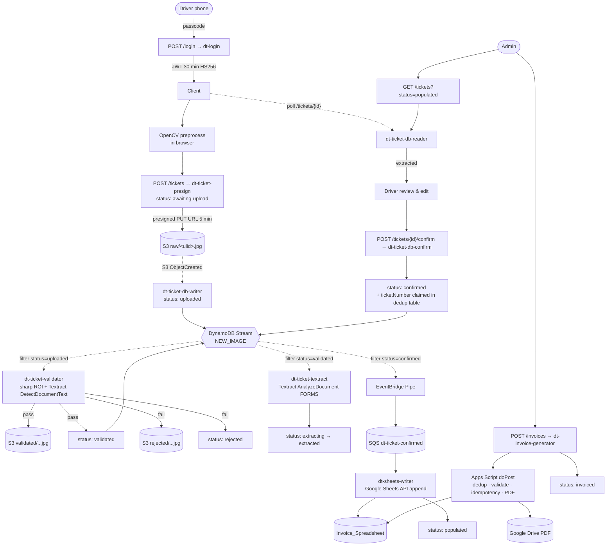
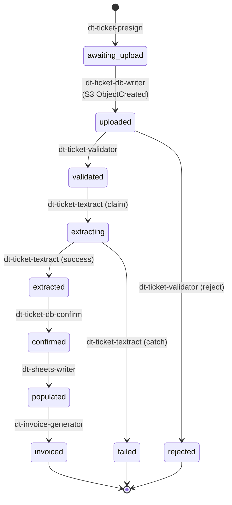

# Dump Truck Backend

A serverless ticket-processing pipeline for a small construction-and-trucking business. Drivers photograph paper work tickets from their phones; the system validates and OCRs each image, lets the driver review and edit the extracted fields, writes the row into the operational Google Sheet, and lets the admin generate invoice PDFs from any subset of populated tickets. Built on AWS SAM ([template.yaml](template.yaml)): Lambda, DynamoDB, S3, SQS, EventBridge Pipes, API Gateway HTTP API, with a Google Apps Script web app handling sheet mutations and PDF rendering.

---

## Scale and operating context

The system is sized for a single operating crew:

- At most **~10 tickets/day** across two drivers (`VV01`, `VV02`).
- At most **1 invoice/day**, generated by a single admin.
- **Google Sheets is the business's source of truth** — the bookkeeper still edits rows by hand. The Lambda pipeline writes *into* the sheet; DynamoDB is not canonical for anything the bookkeeper cares about.

This shapes nearly every design choice. The pipeline does not chase throughput, concurrency, or horizontal scaling — it optimizes for **operational clarity, idempotency, and clean recovery from rare failures**, because at 10 events/day a single stuck record is a meaningful percentage of the day's work. Where a decision is load-bearing on this constraint (hand-rolled JWT, public-read on `validated/`, Sheets-as-DB, no authorizer cache), the rationale is called out inline.

---

## Architecture

The system has three runtime planes:

1. **HTTP edge** — API Gateway HTTP API ([Api](template.yaml#L24-L37)) with a single custom Lambda authorizer (`JwtAuthorizer`) attached to every route except `POST /login`.
2. **Event pipeline** — `TicketTable`'s DynamoDB stream fans out to three consumers via filter patterns on the `status` attribute. Two consumers (`validator`, `textract`) are direct event-source mappings with DLQs; the third (`sheets-writer`) goes through an EventBridge Pipe → SQS for retry-with-redrive semantics.
3. **Apps Script web app** — a public HTTPS endpoint executing as the deploying Google user, secured by a shared admin secret in the request body, with `LockService` serializing concurrent invocations.

---

## Resource inventory

### Lambda functions

| Name | Trigger | Purpose | Code |
|---|---|---|---|
| `dt-login` | `POST /login` (no auth) | Validates passcode against SSM, mints HS256 JWT. | [src/handlers/dt-login/index.mjs](src/handlers/dt-login/index.mjs) |
| `dt-jwt-authorizer` | API Gateway authorizer | Verifies JWT signature + expiry, forwards `user` claim as context. | [src/handlers/dt-jwt-authorizer/index.mjs](src/handlers/dt-jwt-authorizer/index.mjs) |
| `dt-ticket-presign` | `POST /tickets` | Creates ticket row in `awaiting-upload`, returns presigned S3 PUT URL. | [src/handlers/dt-ticket-presign/index.mjs](src/handlers/dt-ticket-presign/index.mjs) |
| `dt-ticket-db-writer` | S3 `ObjectCreated` on `raw/*.jpg` | Flips `awaiting-upload` → `uploaded` once the image lands. | [src/handlers/dt-ticket-db-writer/index.mjs](src/handlers/dt-ticket-db-writer/index.mjs) |
| `dt-ticket-validator` | DynamoDB stream, `status=uploaded` | MIME/size check; sharp-based ROI crop; Textract `DetectDocumentText` for ticket-number presence; writes to `validated/` or `rejected/`. | [src/handlers/dt-ticket-validator/index.mjs](src/handlers/dt-ticket-validator/index.mjs) |
| `dt-ticket-textract` | DynamoDB stream, `status=validated` | Textract `AnalyzeDocument` (FORMS), key-value extraction, post-processing (case, time parsing, OCR fixups), confidence scoring. | [src/handlers/dt-ticket-textract/index.mjs](src/handlers/dt-ticket-textract/index.mjs) |
| `dt-ticket-db-reader` | `GET /tickets`, `GET /tickets/{id}` | Driver fetch-by-id (with presigned image URL once `extracted`); admin list by status (via GSI) or full scan. | [src/handlers/dt-ticket-db-reader/index.mjs](src/handlers/dt-ticket-db-reader/index.mjs) |
| `dt-ticket-db-confirm` | `POST /tickets/{id}/confirm` | Server-side validation of edited fields; quarter-hour rounding + amount cap; transactional write of `confirmed` + ticket-number dedup. | [src/handlers/dt-ticket-db-confirm/index.mjs](src/handlers/dt-ticket-db-confirm/index.mjs) |
| `dt-sheets-writer` | SQS `dt-ticket-confirmed` | Builds the 14-column row, appends to the Invoice spreadsheet via Sheets API, transactionally flips `confirmed` → `populated`. | [src/handlers/dt-sheets-writer/index.mjs](src/handlers/dt-sheets-writer/index.mjs) |
| `dt-invoice-generator` | `POST /invoices` (admin only) | `BatchGet` selected tickets, forwards to Apps Script with shared secret, transactionally flips `populated` → `invoiced`. | [src/handlers/dt-invoice-generator/index.mjs](src/handlers/dt-invoice-generator/index.mjs) |
| `TicketStageRecovery` | *(planned)* | CloudWatch-scheduled sweep for tickets stuck in transient states (`extracting`, `confirmed`, `awaiting-upload`); folder exists but unimplemented. | [src/handlers/TicketStageRecovery/](src/handlers/TicketStageRecovery/) |

All functions are **nodejs22.x on arm64** with `Tracing: Active` and JSON `LoggingConfig` ([template.yaml:13-22](template.yaml#L13-L22)). Default timeout is 30s; the validator (512 MB / 60s) and textract (1024 MB / 60s) functions have raised limits ([template.yaml:201-202](template.yaml#L201-L202), [template.yaml:254-255](template.yaml#L254-L255)).

### DynamoDB tables

| Name | Keys | GSIs | Stream | Notes |
|---|---|---|---|---|
| `dt-tickets-{stage}` | PK `ticketId` (ULID) | `status-ticketDate-index` (PK `status`, SK `ticketDate`, projection ALL) | `NEW_IMAGE` | PAY_PER_REQUEST, SSE on, PITR on, `Retain` on delete. Stream drives validator, textract, and the confirmed-pipe. ([template.yaml:468-499](template.yaml#L468-L499)) |
| `dt-ticket-numbers-{stage}` | PK `ticketNumber` | — | — | Dedup table for paper ticket numbers. Insert at confirm time; updated at populate time with `status: populated, populatedAt`. ([template.yaml:501-517](template.yaml#L501-L517)) |

### S3

| Name | Layout | Notes |
|---|---|---|
| `dt-ticket-images-{stage}-{accountId}` | `raw/{ulid}.jpg`, `validated/{ulid}.jpg`, `rejected/{ulid}.jpg` | Versioning on; noncurrent versions expire at 30 days; AES256 default encryption; CORS allows PUT+GET from any origin; **bucket policy grants public read on `validated/*`** ([template.yaml:552-563](template.yaml#L552-L563)) so the Sheets HYPERLINK formula can resolve without presigning. |

### Queues and pipes

| Name | Purpose |
|---|---|
| `dt-ticket-validator-dlq` | Captures stream events the validator failed to process after 3 retries with bisect-on-error. ([template.yaml:565-569](template.yaml#L565-L569)) |
| `dt-ticket-textract-dlq` | Same, for the textract stream consumer. ([template.yaml:571-575](template.yaml#L571-L575)) |
| `dt-ticket-confirmed` | Standard SQS, 120s visibility timeout; redrives to its DLQ after 3 receives. Sole consumer is `dt-sheets-writer`. ([template.yaml:583-590](template.yaml#L583-L590)) |
| `dt-ticket-confirmed-dlq` | DLQ for the above. ([template.yaml:577-581](template.yaml#L577-L581)) |
| `dt-ticket-confirmed-pipe` | EventBridge Pipe: filters `TicketTable` stream for `status=confirmed`, batch size 1, target is the SQS queue. ([template.yaml:623-636](template.yaml#L623-L636)) |

### HTTP API routes

| Method | Path | Auth | Handler |
|---|---|---|---|
| POST | `/login` | none | `dt-login` |
| POST | `/tickets` | JWT | `dt-ticket-presign` |
| GET | `/tickets` | JWT (admin only, enforced in handler) | `dt-ticket-db-reader` |
| GET | `/tickets/{ticketId}` | JWT | `dt-ticket-db-reader` |
| POST | `/tickets/{ticketId}/confirm` | JWT | `dt-ticket-db-confirm` |
| POST | `/invoices` | JWT (admin only, enforced in handler) | `dt-invoice-generator` |

### Secrets and parameters

All deployment-bound secrets live in **AWS Systems Manager Parameter Store** under `/dt/{stage}/...` and are loaded via a small in-memory cache ([src/shared/ssm.mjs](src/shared/ssm.mjs)):

- `/dt/{stage}/jwt-secret` — HS256 signing secret (`dt-login`, `dt-jwt-authorizer`).
- `/dt/{stage}/passcode/{vv01,vv02,admin}` — driver and admin login passcodes (`dt-login`).
- `/dt/{stage}/sheets/spreadsheet-id` — Sheets file ID (`dt-sheets-writer`).
- `/dt/{stage}/apps-script-url` — Apps Script web-app URL (`dt-invoice-generator`).
- `/dt/{stage}/admin-secret` — shared secret sent to Apps Script (`dt-invoice-generator`).

The Google service-account JSON for the Sheets API lives in **Secrets Manager** as `dt-ticket/google-sa` (`dt-sheets-writer` only). KMS decrypt is allowed only via `ssm.{region}.amazonaws.com` ([template.yaml:64-67](template.yaml#L64-L67)).

### Layers

- `dt-google-api-layer` — `googleapis` SDK ([layers/dt-google-api/](layers/dt-google-api/)), attached to `dt-sheets-writer`.
- `dt-sharp-layer` — `sharp` native image library ([layers/dt-sharp/](layers/dt-sharp/)), attached to `dt-ticket-validator`. Both layers are nodejs22.x / arm64.

---

## Ticket lifecycle

Every transition is a conditional DynamoDB write: the `UpdateCommand` carries `ConditionExpression: #status = :<prev>`, so two consumers racing the same event can both fire and only the first one wins. `ConditionalCheckFailedException` is then treated as a normal no-op, not an error.

| State | Set by | Condition | Fields stamped |
|---|---|---|---|
| `awaiting-upload` | `dt-ticket-presign` ([L28-L40](src/handlers/dt-ticket-presign/index.mjs#L28-L40)) | `attribute_not_exists(ticketId)` | `userId`, `rawKey`, `timestamps.createdAt` |
| `uploaded` | `dt-ticket-db-writer` ([L21-L38](src/handlers/dt-ticket-db-writer/index.mjs#L21-L38)) | `status = awaiting-upload` | `timestamps.uploadedAt` |
| `rejected` | `dt-ticket-validator` ([L55-L94](src/handlers/dt-ticket-validator/index.mjs#L55-L94)) | `status = uploaded` | `statusMessage`, `timestamps.rejectedAt` |
| `validated` | `dt-ticket-validator` ([L143-L162](src/handlers/dt-ticket-validator/index.mjs#L143-L162)) | `status = uploaded` | `validatedKey`, `ticketNumber`, `timestamps.validatedAt` |
| `extracting` | `dt-ticket-textract` ([L74-L91](src/handlers/dt-ticket-textract/index.mjs#L74-L91)) | `status = validated` | `timestamps.extractingAt` |
| `extracted` | `dt-ticket-textract` ([L254-L274](src/handlers/dt-ticket-textract/index.mjs#L254-L274)) | `status = extracting` | `extractedData`, `extractionConfidence`, `extractionApex`, `timestamps.extractedAt` |
| `failed` | `dt-ticket-textract` ([L279-L298](src/handlers/dt-ticket-textract/index.mjs#L279-L298)) | `status = extracting` | `statusMessage`, `timestamps.failedAt` |
| `confirmed` | `dt-ticket-db-confirm` ([L159-L196](src/handlers/dt-ticket-db-confirm/index.mjs#L159-L196)) | `status = extracted` + `attribute_not_exists(ticketNumber)` in `dt-ticket-numbers` (transaction) | `confirmedData`, `ticketDate`, `hours`, `amount`, `rate`, `timestamps.confirmedAt` |
| `populated` | `dt-sheets-writer` ([L99-L132](src/handlers/dt-sheets-writer/index.mjs#L99-L132)) | `status = confirmed` (transaction also stamps ticket-number row) | `timestamps.populatedAt` |
| `invoiced` | `dt-invoice-generator` ([L148-L168](src/handlers/dt-invoice-generator/index.mjs#L148-L168)) | `status = populated` (transaction over all selected `ticketIds`) | `invoiceId`, `invoicePdfUrl`, `timestamps.invoicedTimestamp` |

Terminal states: `rejected`, `failed`, `invoiced`. `extracting` and `confirmed` are *transient* states — they represent "claimed but not yet finished" and require external assistance (retries, SQS redelivery, or the planned `TicketStageRecovery` sweeper) to clear if the worker dies between the claim and the next durable write.

---

## End-to-end happy path

### 1 — Login

Driver opens the web client, enters their passcode. `POST /login` hits [dt-login](src/handlers/dt-login/index.mjs) with no authorizer. The handler reads four SSM parameters in one call (cached in-process by [src/shared/ssm.mjs](src/shared/ssm.mjs)), maps the passcode to a userId (`VV01`, `VV02`, or `ADMIN`), and returns an HS256 JWT minted by [src/shared/jwt.mjs](src/shared/jwt.mjs) with payload `{ user, exp }` and a 30-minute lifetime ([jwt.mjs:10](src/shared/jwt.mjs#L10)). Wrong passcode → 401.

### 2 — Client-side preprocessing (frontend repo)

Before upload the client runs an OpenCV pipeline in-browser: grayscale, Gaussian blur, Canny edges, contour detection, four-point polygon detection with aspect-ratio and area sanity checks, perspective transform, landscape rotation. Result is a cleaned JPEG previewed to the driver.

### 3 — Mint ticket + presigned upload

`POST /tickets` → [dt-ticket-presign](src/handlers/dt-ticket-presign/index.mjs):

- Pulls `user` from the authorizer context.
- Generates a [ULID](https://github.com/ulid/spec) `ticketId` — lexicographically sortable, collision-resistant.
- Writes a row to `dt-tickets` with `status: awaiting-upload`, `userId`, `rawKey: raw/{ulid}.jpg`, `timestamps.createdAt`. The `ConditionExpression: attribute_not_exists(ticketId)` is belt-and-suspenders against a ULID collision.
- Returns a presigned S3 PUT URL (`Content-Type: image/jpeg`, **300s expiry**) and the ticketId.

Client immediately `PUT`s the preprocessed JPEG to the URL.

### 4 — S3 → `uploaded`

The PUT to `raw/*.jpg` fires an S3 `ObjectCreated` notification ([template.yaml:172-184](template.yaml#L172-L184)) that invokes [dt-ticket-db-writer](src/handlers/dt-ticket-db-writer/index.mjs). It parses the ULID from the key, conditionally flips `awaiting-upload` → `uploaded`. A failed conditional check (e.g. someone uploaded the same key twice) is logged and swallowed, not thrown.

### 5 — DynamoDB stream → `validated` or `rejected`

The status flip fires a `NEW_IMAGE` stream record. The event-source mapping for [dt-ticket-validator](src/handlers/dt-ticket-validator/index.mjs) filters for `status=uploaded` ([template.yaml:229-231](template.yaml#L229-L231)), batch size 1, 3 retries, bisect-on-error, dedicated DLQ.

The validator:

1. Downloads the image from `raw/`.
2. Rejects unless `Content-Type` is `image/jpeg`.
3. Rejects unless size is in `[10 KB, 5 MB]`.
4. Uses `sharp` to extract the **top-right 33% × 7% region** (where the printed ticket number sits) and runs **Textract `DetectDocumentText`** on the crop only — a cost optimization that avoids paying for `AnalyzeDocument` (FORMS) on images that have no detectable ticket number.
5. Looks for a word matching `^\d{4,10}$`. If none, reject.
6. Otherwise re-uploads the image (unchanged) to `validated/{ulid}.jpg` and conditionally flips status to `validated`, stamping `validatedKey` and `ticketNumber`.

Rejection path also writes the original bytes to `rejected/{ulid}.jpg` so the admin can inspect failures. The reject and success paths both carry `ConditionExpression: status = uploaded`, so a retry on a row that already moved on is a no-op.

### 6 — DynamoDB stream → `extracting` → `extracted`

The `validated` write fires a second stream event. [dt-ticket-textract](src/handlers/dt-ticket-textract/index.mjs) filters for `status=validated`:

1. **Atomic claim:** flips `validated` → `extracting`. If another consumer beat it, the conditional check fails and the function returns silently.
2. Downloads the `validated/` image and calls **Textract `AnalyzeDocument` with `FeatureTypes: ["FORMS"]`**.
3. Builds a normalized key-value map (`date`, `day`, `customerName`, `jobName`, `city`, `truckNo`, `start`, `stop`), with each value carrying a confidence score and the top-right polygon point ("apex") of its bounding box. The apex is used by the frontend to overlay the editable input on top of the corresponding field on the displayed ticket image.
4. Applies field-level cleanup: known customer-name corrections (`faulcomer → Faulconer`), date separator normalization (`. -` → `/`), title-casing for names and jobs, 12h→24h time parsing, and OCR fixups for truck IDs (`O→0`, `I→1`, `L→1`).
5. Conditionally flips `extracting` → `extracted` and writes `extractedData`, `extractionConfidence`, `extractionApex`.
6. If *anything* throws between the claim and the final write, the catch block conditionally flips `extracting` → `failed` with a `statusMessage`, then re-throws so the stream consumer's DLQ also receives the event.

### 7 — Driver review and confirm

The client polls `GET /tickets/{ticketId}` against [dt-ticket-db-reader](src/handlers/dt-ticket-db-reader/index.mjs):

- 404 if the ticket doesn't exist; 403 if `userId` mismatch and requester is not `ADMIN`.
- Returns `status` and `statusMessage` in all cases.
- When `status === extracted` and `validatedKey` is set, also returns `extractedData` and a **presigned GET URL** for the validated image (15-min expiry).

The UI renders the image with editable fields anchored at the `extractionApex` points. The driver corrects mistakes and submits `POST /tickets/{ticketId}/confirm` to [dt-ticket-db-confirm](src/handlers/dt-ticket-db-confirm/index.mjs). Server-side validation is strict:

| Check | Failure → 400 unless noted |
|---|---|
| All 8 required string fields present and non-empty | `ticketNumber, date, day, customerName, jobName, start, stop, truckNo` |
| Spreadsheet-formula injection guard | `customerName`, `jobName`, `ticketNumber` cannot start with `=`, `+`, `-`, `@` |
| `ticketNumber` matches `^\d{4,10}$` | |
| `customerName`, `jobName` ≤ 50 chars | |
| `customerName`, `jobName` have no lowercase-leading words | (e.g. "smith" caught, "Smith" passes) |
| `date` parses as `YYYY-MM-DD` or `M/D/YY[YY]` and is a real calendar date | normalized to ISO |
| `day` matches weekday of `date` (case-insensitive) | rewritten to canonical Sunday–Saturday |
| `date` within the past 7 days | |
| `start`, `stop` match `HH:MM`; `stop > start` | |
| `truckNo` in fleet `[VV01, VV02]` | |
| `truckNo` matches requester's userId (admin bypasses) | |
| `hours = round((stop - start) / 60 × 4) / 4` (quarter-hour rounding) | |
| `amount = hours × rate` ≤ `$MAX_AMOUNT` (default `$5000`) | |

If all checks pass, a single **`TransactWriteCommand`** does both:

- `UPDATE` `dt-tickets`: status → `confirmed`, plus `confirmedData`, `ticketDate`, `hours`, `amount`, `rate`. Condition `status = extracted`.
- `PUT` `dt-ticket-numbers`: `{ ticketNumber, createdAt }`. Condition `attribute_not_exists(ticketNumber)` — this is the system's defense against the same paper ticket being submitted twice.

A `TransactionCanceledException` from either condition → 409 to the client.

### 8 — Stream → Pipe → SQS → Sheets

The `confirmed` write fires a third stream event. This stage uses a different topology than the previous two — an **EventBridge Pipe** ([template.yaml:623-636](template.yaml#L623-L636)) filters for `status=confirmed`, batch size 1, and writes to a standard **SQS** queue with `VisibilityTimeout: 120s` and a `maxReceiveCount: 3` redrive policy to a dedicated DLQ. The pipe assumes a least-privilege IAM role ([template.yaml:592-621](template.yaml#L592-L621)) that only grants stream read on the source and `sqs:SendMessage` on the target.

Why Pipe+SQS instead of a direct event-source mapping like the earlier stages? **Because the failure mode is different.** Validator and textract failures are usually deterministic (bad image, Textract throws on a malformed crop) — the DLQ is the right place. The sheets-writer talks to a third-party API (Google Sheets) whose failures are usually transient (rate limit, 5xx). SQS gives us a queue with native retry-with-redelivery semantics independent of the stream's iterator position.

[dt-sheets-writer](src/handlers/dt-sheets-writer/index.mjs):

1. Parses the stream record out of the SQS body, `GetItem`s the full ticket. If the row is gone, log and exit (message acks).
2. Lazily initializes a `google.sheets` client from the service-account JSON in Secrets Manager (`dt-ticket/google-sa`), scoped to `https://www.googleapis.com/auth/spreadsheets`.
3. Reformats the row for the sheet: `date` to `M/D/YYYY`, `start`/`stop` to 12-hour `HH:MM AM/PM`, ticket number as `=HYPERLINK("<plain S3 URL to validated image>", "<ticketNumber>")`.
4. Appends to `Invoice_Spreadsheet!A3:N` with `valueInputOption: USER_ENTERED, insertDataOption: INSERT_ROWS`. The Sheets API atomically picks the next empty row.
5. Single **`TransactWriteCommand`**: flip `dt-tickets` `confirmed` → `populated` (condition), and stamp `dt-ticket-numbers` with `status: populated, populatedAt`. A `TransactionCanceledException` (ticket already populated) → log and exit cleanly. Any other error → throw, SQS retries.

Sheet columns:

| Col | Field |
|---|---|
| A | Date (M/D/YYYY) |
| B | Customer |
| C | Job |
| D | Ticket # (HYPERLINK to validated image) |
| E | Start (12h) |
| F | End (12h) |
| G | Hours |
| H | Amount |
| I | Invoice # (blank; filled by Apps Script at invoice time) |
| J | Paid (blank; bookkeeper-managed) |
| K | Rate |
| L | Truck # |
| M | Notes (blank; Apps Script writes "duplicate" in red here) |
| N | Flags (blank) |

This column layout is duplicated in [apps-script/schema.js](apps-script/schema.js) — both ends of the integration must agree.

### 9 — Admin generates an invoice

Admin signs in (same `/login` flow, separate passcode → `userId: ADMIN`) and hits `GET /tickets?status=populated`. The reader handler restricts list endpoints to `ADMIN` ([db-reader/index.mjs:52](src/handlers/dt-ticket-db-reader/index.mjs#L52)), then queries `status-ticketDate-index` to return all populated tickets with presigned image URLs. The frontend groups by `ticketDate` and posts `{ date, ticketIds }` to `/invoices`.

[dt-invoice-generator](src/handlers/dt-invoice-generator/index.mjs):

1. Rejects unless the JWT claim `user === "ADMIN"`.
2. Validates body: `date` is `YYYY-MM-DD`, `ticketIds` is a non-empty string array.
3. `BatchGet` all `ticketIds`. 404 if any missing, 409 if any ticket's `ticketDate ≠ date`.
4. Converts `date` to `M/D/YYYY` and posts to the Apps Script web app with the shared secret, 25s timeout, the per-ticket payload `{ ticketId, truckNo, ticketNumber, customerName, jobName, rate, hours, amount }`.
5. On Apps Script success, transactionally flips every selected ticket `populated` → `invoiced` and stamps `invoiceId`, `invoicePdfUrl`, `timestamps.invoicedTimestamp`. Returns 200 to the admin with the PDF URL.

### 10 — Apps Script (PDF + sheet hyperlink)

[apps-script/doPost.js](apps-script/doPost.js) runs the trickiest bit of business logic in the system, because the sheet is *also* edited by hand:

1. Acquires a script-level lock (`LockService.waitLock(10000)`). Concurrent invocations get 503 — a defense against the admin double-clicking "Generate".
2. Compares the request `secret` against the `ADMIN_SECRET` script property. 403 on mismatch. (This is the only line of defense — the web app is deployed `access: ANYONE_ANONYMOUS` per [appsscript.json](apps-script/appsscript.json).)
3. Scans all rows in `Invoice_Spreadsheet`, filters to those matching the request date.
4. **Duplicate handling.** Groups rows by ticket number. If multiple sheet rows have the same ticket number, finds the row that matches *all* request fields (`truckNo, ticketNumber, customer, job, rate, hours, amount`) and treats it as canonical; marks every other row's `Notes` cell with "duplicate" in red. If no canonical match is found, throws — manual intervention required.
5. **Validation.** For each canonical row, diffs the sheet values against the request payload. Any mismatch throws with field-level detail.
6. **Idempotency.** If every canonical row already has the same value in the Invoice # column, returns `{ alreadyProcessed: true, invoiceId, pdfUrl }` (`pdfUrl` extracted from the existing HYPERLINK formula). Partial state (some invoiced, some not) throws.
7. **Invoice number.** Reads the entire Invoice # column, finds the max `YYDT###` value for the current year prefix, increments by 1; first invoice of a new year is `YYDT000`.
8. **PDF.** Populates the `Invoice_Template` sheet ([apps-script/pdfGenerator.js](apps-script/pdfGenerator.js)) with the canonical rows, exports via Sheets `export?format=pdf`, uploads to the Drive folder identified by the `INVOICES_FOLDER` script property.
9. **Link back.** For each canonical row, writes `=HYPERLINK("<pdfUrl>", "<invoiceId>")` into the Invoice # column.
10. If step 9 throws after the PDF was already created, deletes the Drive file as cleanup and re-throws. This keeps the Drive folder and the sheet in sync: either both have the invoice or neither does.

If the Apps Script call succeeded but the Lambda's `populated → invoiced` transaction fails, the lambda **does not** roll back the sheet — instead it returns 200 with a `warning` field and logs for manual reconciliation ([dt-invoice-generator/index.mjs:171-181](src/handlers/dt-invoice-generator/index.mjs#L171-L181)). The reasoning: the admin already has the PDF URL, the sheet already shows the invoice, and the DynamoDB status is the least-canonical view of the world. Better to surface the partial state than to attempt a multi-system rollback that could itself fail.

### Happy-path verification

[scripts/test-pipeline.sh](scripts/test-pipeline.sh) is the end-to-end harness: it logs in as a driver, mints a ticket, PUTs a real JPEG from [fixtures/](fixtures/), polls the row until `extracted` (60s timeout), POSTs `/confirm` with the extracted fields, waits for `populated` (30s), logs in as admin, POSTs `/invoices`, and asserts the final `invoiced` status plus presence of `invoiceId` and `pdfUrl`. It does not auto-clean the sheet row or the Drive PDF — those have to be removed by hand.

---

## Authentication and authorization

### Passcode → JWT

Drivers and admin share a single login endpoint, `POST /login`. Each principal has a distinct passcode stored as a SecureString in SSM; the handler matches the incoming passcode against the decrypted values and emits a token. Passcodes are not hashed — they're symmetric secrets, treated like API keys.

The JWT is **HS256, hand-rolled** in [src/shared/jwt.mjs](src/shared/jwt.mjs). The body carries only `{ user, exp }`. Lifetime is **30 minutes**, refreshed by re-login (there is no refresh-token flow). Signature verification uses `crypto.timingSafeEqual` to avoid timing attacks. The implementation is intentionally minimal — at three principals and ~10 logins/day, a third-party JWT library would be overhead, and rolling out a library upgrade would touch more code than the entire signer.

### Authorizer

Every route except `/login` is gated by [dt-jwt-authorizer](src/handlers/dt-jwt-authorizer/index.mjs), a Lambda authorizer in `EnableSimpleResponses: true` mode. It returns `{ isAuthorized, context: { user } }`. The `user` claim is forwarded to downstream handlers as `event.requestContext.authorizer.lambda.user`.

**There is no authorizer cache.** The template does not set `AuthorizerResultTtlInSeconds`, so on HTTP API every request invokes the authorizer. At this scale that's fine — and it means logout (or a stolen token within its 30-minute window) doesn't have a cache-staleness window to reason about.

### Scopes

There are exactly two scopes — `ADMIN` and "driver (any of VV01, VV02)". The authorizer doesn't distinguish them; **scope enforcement is per-handler**:

- `dt-ticket-db-reader` list endpoints (`GET /tickets[?status=…]`) → 403 unless `user === "ADMIN"`.
- `dt-ticket-db-reader` single-ticket (`GET /tickets/{id}`) → 403 if `t.userId !== user && user !== "ADMIN"`.
- `dt-ticket-db-confirm` → same ownership check; also `truckNo` must equal `user` (admin bypass).
- `dt-invoice-generator` → 403 unless `user === "ADMIN"`.

This puts the authorization logic adjacent to the data it protects, which is preferable to encoding scopes in the JWT for a system this small — fewer surfaces to keep in sync.

---

## External integrations

### Amazon Textract

Two distinct calls per ticket:

1. **`DetectDocumentText` on a 33% × 7% ROI** (validator) — used solely to confirm a ticket number is present before committing to the expensive call. Cheap and fast.
2. **`AnalyzeDocument` with `FeatureTypes: ["FORMS"]`** (textract) — full key-value extraction. Substantially more expensive per page.

Throttling and synchronous-API failures both bubble out of the lambda. For the textract stage, the catch block flips status to `failed` *and* re-throws, so the failure is visible both in DynamoDB (`statusMessage`) and in the DLQ (full event payload for replay).

### Google Sheets API

Service-account-based, scoped to `https://www.googleapis.com/auth/spreadsheets`. The credential JSON is held in Secrets Manager (`dt-ticket/google-sa`); the lambda fetches it once per cold start and caches the `sheets` client in a module-level variable. The spreadsheet ID and sheet name are stage-specific (`SPREADSHEET_ID_PARAM` in SSM, `SHEET_NAME` is hardcoded to `Invoice_Spreadsheet`).

The append call uses `INSERT_ROWS` semantics — Google atomically finds the next blank row in the data range and writes there. This is the only Sheets mutation done by the Lambda layer; everything else happens in Apps Script.

### Google Apps Script web app

Deployed via [clasp](https://github.com/google/clasp); separate deployments per stage ([.clasp.dev.json](apps-script/.clasp.dev.json), [.clasp.prod.json](apps-script/.clasp.prod.json)). [appsscript.json](apps-script/appsscript.json) declares:

- `executeAs: USER_DEPLOYING` — every invocation runs with the deploying user's Drive/Sheets privileges.
- `access: ANYONE_ANONYMOUS` — endpoint is publicly callable.

Security model: **the URL is unguessable but not secret**, and the `secret` field in the request body is the actual access control. The shared secret is held in SSM on the AWS side (`/dt/{stage}/admin-secret`) and as a Script Property on the Apps Script side (`ADMIN_SECRET`).

The script also defines a manual-fallback `Invoices > Generate Invoice for Selected Row` menu ([apps-script/menu.js](apps-script/menu.js)) that the bookkeeper can use to regenerate an invoice purely from sheet state, bypassing the Lambda entirely. This is the system's hand-operable recovery path if the Lambda integration is broken.

### Google Drive

Used purely as a PDF blob store. The destination folder is identified by the `INVOICES_FOLDER` script property. The Lambda doesn't talk to Drive directly; only Apps Script does, using its native `DriveApp` binding.

---

## Failure modes and mitigations

Every row in this matrix lists the detection signal, the current mitigation, and the residual risk *given the 10-tickets-per-day scale*. "Accepted risk" means a stuck record is acceptable because a human will notice within a single business day.

### Stage 1 — Presign and upload

| Failure | Detection | Mitigation | Residual risk |
|---|---|---|---|
| Presign URL expires before client PUTs (>5 min) | Row sits at `awaiting-upload`; no `uploadedAt` timestamp. | Client retries via fresh `POST /tickets` (new ticketId). Old row stays orphaned. | Orphan rows in DynamoDB. **Planned:** `TicketStageRecovery` sweep. **Accepted** until then. |
| Client uploads but never polls | Row reaches `extracted`, no `confirm`. | Admin sees it in `GET /tickets?status=extracted`. | Manual recovery. Accepted. |
| S3 PUT lands but `dt-ticket-db-writer` fails | S3 has the object; row stuck at `awaiting-upload`. | S3 event delivery has built-in retries; if the lambda repeatedly errors, S3 will give up after the configured retries. | Detectable by mismatch between `raw/` keys and rows in `awaiting-upload`. Accepted; no automated reconciliation. |
| Duplicate S3 PUT to the same key | Conditional check on `status = awaiting-upload` fails on second invoke. | Logged and swallowed ([db-writer/index.mjs:42-45](src/handlers/dt-ticket-db-writer/index.mjs#L42-L45)). | None. |

### Stage 2 — Validator

| Failure | Detection | Mitigation | Residual risk |
|---|---|---|---|
| Non-JPEG MIME, size out of range, no ticket number found | Validator transitions row to `rejected` with `statusMessage`. Image preserved in `rejected/`. | UI surfaces `statusMessage` on poll. Admin reviews the rejected image. | None — this is the designed-for failure mode. |
| Textract throttling on the ROI call | Lambda throws; stream consumer retries 3× with bisect-on-error; on exhaustion the event lands in `dt-ticket-validator-dlq`. | Manual replay from DLQ. | At ~10 tickets/day, throttling is essentially impossible. Accepted. |
| Sharp throws on a corrupt JPEG | Same as above — lambda throws, DLQ captures. | Manual investigation. Row stays at `uploaded`. | Accepted. |
| Validator succeeds writing `validated/` to S3 but DDB update fails the conditional check | S3 has an orphan `validated/` object. | None automated. | Minor — orphan never gets referenced because the status is wrong. Accepted. |

### Stage 3 — Textract

| Failure | Detection | Mitigation | Residual risk |
|---|---|---|---|
| Textract API failure (5xx, throttling, malformed response) | Catch block flips `extracting` → `failed` with `statusMessage`, re-throws so DLQ also captures. | UI shows `failed`. Admin can manually retry by re-uploading. | DLQ has the original event for replay; no automated retry beyond the 3 stream attempts. Accepted. |
| Lambda crash/timeout *between* the `extracting` claim and the final write | Row stuck at `extracting`; no `extractedAt`. | Stream consumer retries the same event; the second attempt's claim no-ops (already `extracting`) and the work proceeds. **If the catch block also fails**, row stays at `extracting` permanently. | **Planned:** `TicketStageRecovery` sweeps by age. **Accepted** until then. |
| Extracted KV map has noisy or missing fields | No automated detection — extraction returns whatever Textract gave. | Driver review at confirm time catches the issues. Confirm-handler validation enforces field-level correctness before write. | None — this is by design; the human is the final filter. |

### Stage 4 — Confirm

| Failure | Detection | Mitigation | Residual risk |
|---|---|---|---|
| Duplicate paper ticket number | Conditional `attribute_not_exists(ticketNumber)` on `dt-ticket-numbers` fails inside the transaction → `TransactionCanceledException` → 409 to client. | UI surfaces the 409. Admin investigates. | None — this is the canonical duplicate guard. |
| Driver retries confirm after status moved past `extracted` | `status = extracted` condition fails → `TransactionCanceledException` → 409. | UI tells the driver to re-poll. | None. |
| Validation rejection (bad date, formula injection, etc.) | 400 with `details` array. | Driver corrects and resubmits. | None — by design. |
| Race: two confirms with the same body arrive within milliseconds | The DynamoDB transaction is atomic; the second one's `status = extracted` condition will fail. | None needed. | None. |

### Stage 5 — Sheets writer

| Failure | Detection | Mitigation | Residual risk |
|---|---|---|---|
| Google Sheets API 5xx or 429 | Lambda throws; SQS message returns to the queue; redelivered up to 3 times before going to DLQ. | Visibility timeout 120s; redrive after 3 receives. Manual replay from DLQ. | At ≤10 tickets/day, recovery within hours is fine. Accepted. |
| Service-account credential rotation breaks auth | All sheet writes fail; messages pile up then DLQ. | CloudWatch alarms on DLQ depth (not yet wired). Manual rotation via Secrets Manager. | **Planned alarm.** Accepted until then. |
| Lambda succeeds appending to sheet but DDB transaction fails | Sheet has the row; DynamoDB still says `confirmed`. SQS will redeliver the message; the second invocation's `GetItem` still says `confirmed`, the sheet append runs again, and now there are **two** sheet rows. The Apps Script duplicate handler catches this at invoice time. | Apps Script identifies duplicates by ticket number and marks the non-canonical row "duplicate" in red Notes. | Accepted — the duplicate handler is the load-bearing recovery. |
| Lambda crash *after* sheet append, before DDB transaction | Same as above. | Same as above. | Accepted. |

### Stage 6 — Invoice generator

| Failure | Detection | Mitigation | Residual risk |
|---|---|---|---|
| Admin double-clicks "Generate Invoice" | Apps Script `LockService.waitLock(10s)` serializes; second call either sees the first one's lock and 503s, or runs and hits the idempotency check (Invoice # column already populated). | Returns `{ alreadyProcessed: true, invoiceId, pdfUrl }` for the second click; lambda still flips status to `invoiced` (or no-ops if already there). | None — designed-for. |
| Apps Script call fails (timeout, 5xx, network) | Lambda returns 502. **No DynamoDB writes happened.** | Admin retries — pure replay because the ticket statuses are still `populated` and the Apps Script lock + idempotency guards against double-processing. | None significant. |
| PDF generation succeeds but writing the HYPERLINK to the sheet fails | Apps Script's own try-catch deletes the orphaned Drive file and re-throws. | Lambda returns 502; admin retries; idempotency state is clean. | None. |
| Apps Script returns OK, lambda's DDB transaction fails | Sheet has the invoice ID, Drive has the PDF, DynamoDB still says `populated`. | Lambda returns **200 with `warning`** so the admin keeps the PDF URL ([invoice-generator/index.mjs:171-181](src/handlers/dt-invoice-generator/index.mjs#L171-L181)). Manual reconciliation: update the rows by hand. | Accepted — preferable to a multi-system rollback that could itself partially fail. |
| BatchGet returns fewer items than requested (one or more ticketIds missing) | 404 to client. | Admin re-checks the selection. | None. |
| Ticket `ticketDate` doesn't match request `date` | 409 to client. | Admin re-groups. | None. |
| Concurrent invoice generation for different dates | LockService serializes — second call waits up to 10s. | If wait exceeds 10s, 503 to client. | At 1 invoice/day, contention is implausible. Accepted. |

### Cross-cutting failures

| Failure | Detection | Mitigation | Residual risk |
|---|---|---|---|
| Region outage (us-east-1 partial failure, etc.) | All API calls fail. | None — single-region deployment. | At ~10 tickets/day, a day's delay is operationally tolerable. **Accepted** as a deliberate cost trade. |
| Cold-start latency on long-idle lambdas | Slow first response. | None. | At this scale, cold starts are normal. Accepted. |
| JWT secret leak | Tokens still expire in 30 min; rotate `/dt/{stage}/jwt-secret` in SSM. | Manual rotation; no caching means rotation takes effect on next request. | Accepted given threat model (small private user set). |
| DDB stream consumer lag during a Lambda outage | Stream retains 24h of events; will catch up automatically. | None needed. | Accepted. |
| Stuck transient states (`extracting`, `confirmed`) past their `*At` timestamp | Currently undetected. | **Planned:** `TicketStageRecovery` scheduled lambda that scans by status + age and either retries or marks `failed`. | **Open.** Accepted as the most-impactful follow-up. |

---

## Design decisions justified by scale

A few choices in this codebase would be wrong at a higher tier and are deliberate at this one:

- **DynamoDB streams + EventBridge Pipe instead of Step Functions.** Step Functions would buy explicit state-machine semantics, but at the cost of an extra service in the request path and meaningfully higher per-execution cost. With ~10 tickets/day and a state machine that fits in one diagram, the per-stage conditional update *is* the state machine — every transition has a guard.
- **Sheets-as-DB.** The bookkeeper is the dominant user. Moving the canonical store to a managed DB would require a sheet-replacement UI before it could ship. Keeping Sheets means handwritten edits remain first-class, the Apps Script side of the system can be hand-operated when needed (see [menu.js](apps-script/menu.js)), and migration risk is deferred until volume justifies it.
- **Public-read on `validated/*`.** Putting a presigned URL into a `HYPERLINK` formula breaks within hours when the URL expires. A static URL is a worse security posture in principle, but the bucket contents are ticket photos with no personal data beyond a printed customer name, the keys are ULIDs (not enumerable), and the bucket policy is scoped only to `validated/*` ([template.yaml:552-563](template.yaml#L552-L563)). The trade is intentional.
- **Hand-rolled HS256 JWT.** Three principals, one route, one verifier. A library would be more code to audit, not less.
- **No authorizer cache.** At 10 logins/day, the cache hit rate would be near zero; the cost of running the authorizer per request is meaningful only if the authorizer were slow (it isn't — single SSM `GetParameters` call, cached in-process).
- **Sheets-writer dual transaction with the ticket-number table.** Maintaining a parallel `status` field on `dt-ticket-numbers` adds write cost but gives the admin a single-table view of "which paper ticket numbers have been processed" without touching `dt-tickets`. Useful for the manual-replay path.
- **`statusMessage` everywhere.** Every rejection and failure carries a one-line human-readable reason. The UI displays it verbatim. This is cheap and turns silent failures into self-explanatory ones.

---

## Operational tooling

- [scripts/test-pipeline.sh](scripts/test-pipeline.sh) — end-to-end real-AWS happy-path test against a deployed stack. Auto-fetches the API URL from CloudFormation outputs, walks a fixture through the entire pipeline, cleans up Dynamo + S3 artifacts (warns that Sheet row and Drive PDF must be removed by hand).
- [scripts/smoke.sh](scripts/smoke.sh) — pure-HTTP smoke against a deployed API. No AWS-CLI Dynamo/S3 reads. Safe for prod. Verifies route wiring, authorizer behavior on bad/missing tokens, and the admin-vs-driver enforcement points.
- [scripts/test-auth.sh](scripts/test-auth.sh) — local `sam local invoke` of `Login` then `JwtAuthorizer` end-to-end with the freshly minted token.
- [scripts/load-secrets.sh](scripts/load-secrets.sh), [scripts/local.sh](scripts/local.sh), [scripts/nuke-dev.sh](scripts/nuke-dev.sh) — local-dev helpers.

---

## Future migration: Sheets → managed DB

If volume grows past the point where the bookkeeper can keep up with a sheet (estimated several hundred tickets/month), the natural migration is:

1. Add a `dt-invoice-db` table; backfill from the current sheet.
2. Replace [dt-sheets-writer](src/handlers/dt-sheets-writer/index.mjs) with a writer that inserts into the new table, plus a one-way sheet mirror for the bookkeeper's transitional comfort.
3. Reimplement the Apps Script duplicate/idempotency/PDF logic in a Lambda or container that reads from the new table directly; keep the PDF rendering in Apps Script if Drive remains the preferred storage, or move to a headless renderer (Puppeteer in a container).
4. Retire the `dt-ticket-numbers` table — `dt-invoice-db` can carry the uniqueness constraint on `ticketNumber` natively.

The Lambda pipeline up through `confirmed` is unaffected. The pipeline's strict status-machine boundary at `confirmed → populated` is the migration cut point.
