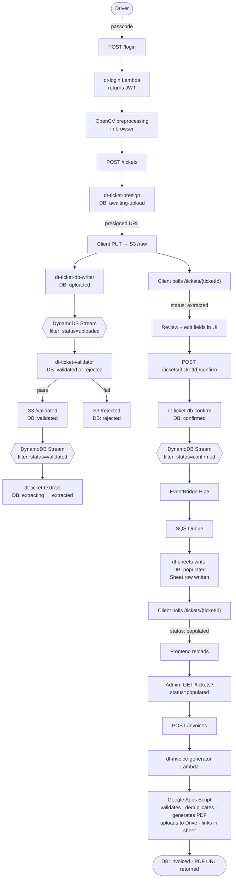
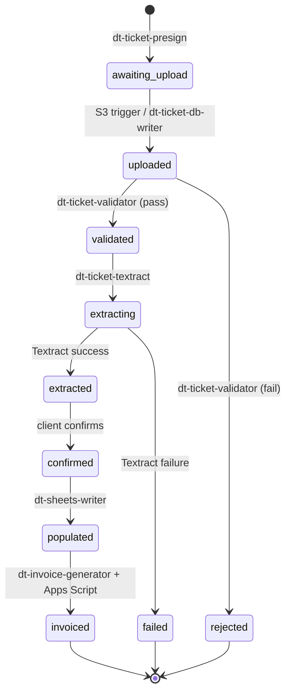

# Dump Truck Backend

A ticket processing app for a small trucking/construction business. Drivers photograph paper tickets in the field; the app validates, extracts, and populates a Google Sheet, then generates invoices as PDFs.

---

## Pipeline Overview

---

## Ticket Status Machine

---

## Auth

- Each driver has their own passcode; admin has a separate one
- Client submits passcode via POST to `/login` on API Gateway
- `dt-login` Lambda validates the passcode and returns a signed JWT (crypto library)
- All downstream routes have a custom Lambda authorizer (`dt-jwt-authorizer`) that validates the token

---

## Frontend Processing

Before upload, the client preprocesses the ticket image using OpenCV:

- Reject unsupported formats
- Convert to grayscale
- Reduce noise with Gaussian blur
- Edge detection (Canny)
- Morphological transform
- Contour detection and sorting
- Ticket area / image area ratio validation
- Find largest polygon and simplify to 4-point polygon
- Validate ticket width/height ratio
- Perspective transform
- Rotate if landscape

Client displays the processed image for preview before uploading.

---

## Raw Upload

1. Client sends POST to `/tickets`
2. `dt-jwt-authorizer` authorizes the request
3. `dt-ticket-presign` Lambda:
   - Grabs user identity from token
   - Generates a random `ticketId`
   - Creates a record in `ticket-db` with status `awaiting-upload`
   - Returns a presigned S3 PUT URL
4. Client PUTs image directly to S3 `/raw` using the presigned URL
5. Client begins polling `/tickets/{ticketId}` (see [Client Polling](#client-polling))

---

## Cloud Validation and Extraction

### S3 Trigger → dt-ticket-db-writer
- Triggered by new object in S3 `/raw`
- Updates status to `uploaded` only if status === `awaiting-upload`

### DynamoDB Stream → dt-ticket-validator
- Triggered by stream record where `status = uploaded` (batch size 1, bisect-on-error, 3 retries, dedicated DLQ)
- Downloads ticket from S3 `/raw`
- On any failure below, sends PUT to S3 `/rejected` and updates status to `rejected` (condition: `status = uploaded`):
  - Content type is not `image/jpeg`
  - File size out of range (10 KB – 5 MB)
  - Ticket number not detected by Textract
- OCRs just the ticket number ROI using Textract `DetectDocumentText`
- TODO: verify aspect ratio, verify blur index, normalize image size
- On success: writes image to S3 `/validated`, then updates status to `validated` with `validatedKey` and `ticketNumber` (condition: `status = uploaded`)

### DynamoDB Stream → dt-ticket-textract
- Triggered by stream record where `status = validated` (batch size 1, bisect-on-error, 3 retries, dedicated DLQ)
- Updates status to `extracting` only if status === `validated` (atomic claim)
- Loads ticket from S3 `/validated`
- Runs Textract
- Updates extracted data in `ticket-db`
- Updates status to `extracted` or `failed` only if status === `extracting`

---

## Client Polling

After the S3 PUT, the client polls `/tickets/{ticketId}`:

- `dt-jwt-authorizer` authorizes the token
- `dt-ticket-db-reader` Lambda has two modes:
  - **GET `/tickets/{ticketId}`** (driver or admin):
    - 404 if ticket doesn't exist
    - 403 if `userId` doesn't match requester (admin bypasses)
    - Returns `status`, `statusMessage`
    - If status === `extracted`, also returns `extractedData` and a presigned GET URL for S3 `/validated`
  - **GET `/tickets?status=X`** (admin only): queries the `status-ticketDate-index` GSI, returns all tickets with that status (with presigned image URLs)
  - **GET `/tickets`** (admin only, no status filter): full table scan

---

## Client Ticket Review

1. Client receives extracted data + validated image URL
2. UI displays image with extracted fields, all editable
3. Driver reviews and edits fields
4. Client sends POST to `/tickets/{ticketId}/confirm`
5. `dt-jwt-authorizer` authorizes the token
6. `dt-ticket-db-confirm` Lambda:
   - GETs the ticket to check ownership and current status (soft guard: returns 409 if not in `extracted`)
   - Validates the submitted `confirmedData`:
     - All required fields present: `ticketNumber`, `date`, `day`, `customerName`, `jobName`, `start`, `stop`, `truckNo`
     - `ticketNumber` matches `^\d{4,10}$`
     - String fields don't start with formula-injection characters (`=`, `+`, `-`, `@`)
     - `date` parses (accepts `YYYY-MM-DD` and `M/D/YY[YY]`) and is a real calendar date
     - Normalizes `date` to ISO `YYYY-MM-DD`
     - `day` matches the weekday derived from `date`
     - `date` is within the past 7 days
     - `start`/`stop` match `HH:MM`; `stop` must be after `start`
     - `truckNo` must be in fleet; must match the driver's identity (or requester is `ADMIN`)
   - Computes `hours` (quarter-hour rounded) and `amount = hours × rate`
   - Returns 400 if `amount > $5,000`
   - Single DynamoDB transaction:
     - Updates `ticket-db` status to `confirmed` (condition: `status = extracted`), sets `confirmedData`, `ticketDate`, `hours`, `amount`, and `rate`
     - Inserts ticket number into `dt-ticket-number-db` (condition: `attribute_not_exists(ticketNumber)`); 409 if duplicate
   - The DynamoDB write triggers the stream that drives `dt-sheets-writer` (no explicit event published)
7. Client polls `/tickets/{ticketId}` until status === `populated`

---

## Google Sheets Population

### DynamoDB Stream → EventBridge Pipe → SQS → dt-sheets-writer

> **Note:** Google Sheets is the business's source of truth. Tickets can be processed manually directly in Sheets.

The confirm lambda's DynamoDB write triggers the stream. An EventBridge Pipe filters for `status = confirmed` and routes each record to a standard SQS queue (120s visibility timeout). The SQS queue triggers `dt-sheets-writer` (batch size 1), with a DLQ for messages that fail after 3 attempts.

- Fetches ticket from `ticket-db`; discards message if not found
- Builds the new row in memory using pre-computed `hours`, `amount`, and `rate` (set at confirm time):

  | Col | Field         |
  |-----|---------------|
  | A   | Date          |
  | B   | Customer      |
  | C   | Job           |
  | D   | Ticket # (`HYPERLINK` to validated image) |
  | E   | Start Time    |
  | F   | End Time      |
  | G   | Hours         |
  | H   | Amount        |
  | I   | Invoice # (left blank; filled by Apps Script) |
  | J   | Paid (left blank) |
  | K   | Rate          |
  | L   | Truck #       |
  | M   | Notes (left blank) |
  | N   | Flags (left blank) |

- Appends the row via `sheets.spreadsheets.values.append` (Google atomically picks the next empty row); on failure the lambda throws and SQS retries
- Single DynamoDB transaction: updates `ticket-db` status to `populated` (condition: `status = confirmed`) and stamps `status = populated` + `populatedAt` on the `ticket-number-db` record; silently exits if transaction is cancelled (ticket already populated)

---

## Invoice Generation

### Admin View

- Admin sends GET to `/tickets?status=populated`
- `dt-ticket-db-reader` queries the `status-ticketDate-index` GSI and returns all matching tickets (with presigned image URLs)
- UI shows badge if there are unprocessed tickets
- Admin groups tickets by date and clicks "Generate Invoice", which POSTs `{ date, ticketIds }` to `/invoices`

### POST /invoices → dt-invoice-generator Lambda

- Auth: JWT authorizer + lambda rejects non-ADMIN claims
- Validates body: `date` (YYYY-MM-DD) and non-empty `ticketIds` array
- `BatchGet` on the provided `ticketIds` to fetch ticket data
- Soft guards: 404 if any ticket missing, 409 if any `ticketDate` doesn't match the requested date
- Converts `date` to `M/D/YYYY` sheet format and calls Google Apps Script (25s timeout), forwarding ticket fields (`truckNo`, `ticketNumber`, `customerName`, `jobName`, `rate`, `hours`, `amount`) and a shared secret fetched from SSM

### Apps Script (`doPost.js`)

- Acquires a script-level lock (`LockService.waitLock(10s)`); returns 503 if busy
- Verifies shared secret against Script Property `ADMIN_SECRET`
- Fetches all rows from `Invoice_Spreadsheet` matching the requested date
- **Duplicate detection**: groups rows by ticket number; for each duplicate group, finds the row that matches all request fields; marks non-matching rows as `duplicate` in red in the Notes column; errors if no matching row exists
- **Validation**: for each canonical row, checks `truckNo`, `ticketNumber`, `customer`, `job`, `rate`, `hours`, `amount` against the request data; errors with field-level diff on mismatch
- **Idempotency**: if all canonical rows already have the same invoice number, returns `{ alreadyProcessed: true, invoiceId, pdfUrl }` without regenerating
- **Invoice number**: scans the entire Invoice # column, finds the max `YYDT###` value for the current year, increments by 1 (first of the year starts at `YYDT000`)
- Generates PDF via the `Invoice_Template` sheet (`pdfGenerator.js`), uploads to Google Drive
- Writes `=HYPERLINK(pdfUrl, invoiceId)` into the Invoice # column for each canonical row; if this write fails, cleans up the uploaded Drive file
- Returns `{ ok: true, invoiceId, pdfUrl, alreadyProcessed?, messages[] }` to the Lambda

### dt-invoice-generator Lambda (continued)

- Logs `"Sheet write succeeded"` once Apps Script returns successfully
- If `alreadyProcessed`: returns 200 immediately without touching DynamoDB
- On success: transactionally updates each ticket to `invoiced`, sets `invoiceId` and `invoicePdfUrl` (condition: `status = populated`)
- If the DynamoDB update fails after the sheet was already written: logs for manual reconciliation and returns 200 with a `warning` field — the invoice PDF exists and the URL is returned so the admin can save it
- Returns `{ invoiceId, pdfUrl, date, ticketIds, messages }` to the client

---

## Planned Handlers (stubs)

The following handler folder exists but is not yet implemented:

- **`TicketStageRecovery`** — will run on a CloudWatch schedule (e.g. every 5 minutes), scan for tickets stuck in transient states (`extracting`, `populating`) past their `*At` timestamp, and either retry or mark them failed. Required because in-lambda retries can't recover from process crashes, timeouts, or any failure between the atomic claim and the next durable write.